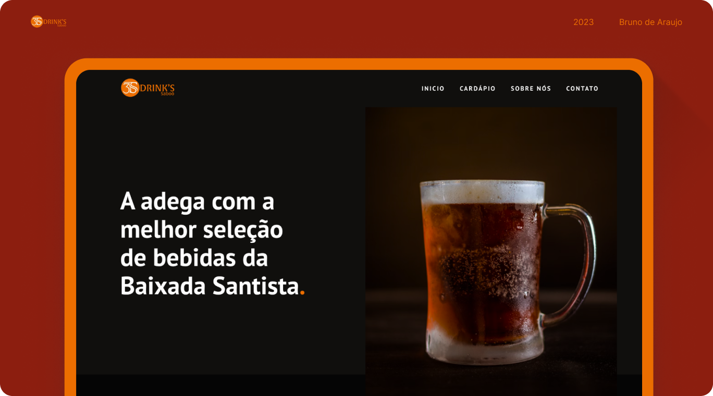

# 3S Drink’s Saboo – Site Institucional

✅ Projeto real desenvolvido para a adega **3S Drink’s Saboo**, localizada em Santos-SP.

🔗 Site publicado: [https://3sdrinks.com.br](https://3sdrinks.com.br)

## ✨ Sobre o projeto

O cliente solicitou um site institucional simples, direto e visualmente marcante, com estética escura e responsiva.

## 💼 Minhas responsabilidades

- Design no Figma
- Desenvolvimento com HTML, CSS e JavaScript
- Aplicação responsiva para mobile e desktop
- Apresentação de produtos e informações de contato

## 🚀 Tecnologias utilizadas

Figma · HTML · CSS · JavaScript

## 📸 Prints do site

## 📍 Status do projeto

✔️ Concluído e publicado
